# BAYESIAN GROUP INFERENCE
# 📊 Assignment 2 — PART 1: Bayesian Group Comparison
### Tips Dataset — Gaussian vs Gamma Likelihoods

---

## 📋 Table of Contents

1. [Dataset Overview](#1-dataset-overview)
2. [Pre-Modelling EDA](#2-pre-modelling-eda)
3. [Model 1 — Tips by Time (Gaussian)](#3-model-1--tips-by-time-gaussian)
4. [Model 2 — Tips by Time (Gamma)](#4-model-2--tips-by-time-gamma)
5. [Model 3 — Tips by Size (Gaussian)](#5-model-3--tips-by-size-gaussian)
6. [Model 4 — Tips by Size (Gamma)](#6-model-4--tips-by-size-gamma)
7. [Gaussian vs Gamma Comparison](#7-gaussian-vs-gamma-comparison)
8. [Posterior Interpretation — Pairwise Differences](#8-posterior-interpretation--pairwise-differences)
9. [Reflection & Conclusion](#9-reflection--conclusion)

---

## 1. Dataset Overview

## 📁 Dataset

Both Part 1 and Part 2 use the **Tips** dataset — a classic restaurant tipping study
bundled with the seaborn library.

| Property | Details |
|----------|---------|
| **Name** | Tips (Restaurant Tipping Data) |
| **Rows** | 244 |
| **Columns** | `total_bill`, `tip`, `sex`, `smoker`, `day`, `time`, `size` |
| **Raw CSV** | [tips.csv](https://raw.githubusercontent.com/mwaskom/seaborn-data/master/tips.csv) |
| **GitHub Viewer** | [seaborn-data/tips.csv](https://github.com/mwaskom/seaborn-data/blob/master/tips.csv) |
| **Source Repo** | [mwaskom/seaborn-data](https://github.com/mwaskom/seaborn-data) |
| **Origin** | Bryant, P. G. and Smith, M. A. (1995), *Practical Data Analysis*, Irwin Publishing, Chicago |

### Loading in Python
```python
import seaborn as sns
tips = sns.load_dataset("tips")
# Internally fetches from:
# https://raw.githubusercontent.com/mwaskom/seaborn-data/master/tips.csv
```

The **tips dataset** contains 244 restaurant observations. We focused on three columns:

| Column | Type | Description |
|--------|------|-------------|
| `tip` | `float64` | Tip amount in USD — our **response variable** |
| `time` | `category` | `Lunch` or `Dinner` — first grouping variable |
| `size` | `int64` | Party size 1–6 — second grouping variable |

**Tip descriptive statistics (observed data):**

| Statistic | Value |
|-----------|-------|
| Count | 244 |
| Mean | $2.998 |
| Std Dev | $1.384 |
| Min | $1.00 |
| 25th percentile | $2.00 |
| Median | $2.90 |
| 75th percentile | $3.56 |
| Max | $10.00 |

**Encodings used for PyMC:**

```python
# Time: 'Lunch' → 0,  'Dinner' → 1
time_idx = time.cat.codes.values
time_names = ['Lunch', 'Dinner']

# Size: 1 → 0, 2 → 1, 3 → 2, 4 → 3, 5 → 4, 6 → 5
size_idx = pd.Categorical(size_raw, categories=sizes).codes
```

---

## 2. Pre-Modelling EDA

Before fitting any model, we visualised the raw data to understand its structure and choose appropriate likelihoods.

### EDA Plots

> **Left:** Histogram of all tip values &nbsp;|&nbsp; **Centre:** Tip by Time of Day (Lunch vs Dinner) &nbsp;|&nbsp; **Right:** Tip by Party Size (box plots)


### Key Observations from EDA

| Observation | Implication |
|-------------|-------------|
| All tips are strictly **positive** (min = $1.00) | Gaussian (unbounded) is theoretically wrong; **Gamma** is natural |
| Distribution is **right-skewed** (long right tail) | Gaussian underestimates the tail; Gamma captures it naturally |
| **Dinner** appears to produce slightly larger tips than Lunch | Worth testing with a group-comparison model |
| Larger **party sizes** → larger absolute tip amounts | A size-based group model is meaningful |
| **Size 1** has very few observations → high uncertainty expected | Posterior HDI will be wider for size 1 |

> **Why this matters:** The choice of likelihood must be justified by the data's domain. Because tips > 0 always and the histogram is asymmetric with a heavy right tail, the **Gamma distribution is a more principled choice** than the Gaussian from the very beginning.

---

## 3. Model 1 — Tips by Time (Gaussian)

### Model Specification

$$tip \sim \mathcal{N}(\mu_{time},\ \sigma)$$

```python
with pm.Model(coords={"time": ["Lunch", "Dinner"]}) as time_gauss:
    mu_time = pm.HalfNormal("mu_time", sigma=5, dims="time")   # per-group mean
    sigma   = pm.HalfNormal("sigma",   sigma=2)                 # shared std dev
    tip_obs = pm.Normal("tip_obs", mu=mu_time[time_idx], sigma=sigma, observed=tip)
```

**Prior choices:**
- `HalfNormal(sigma=5)` for means — weakly informative; restricts to positive values since tips can't be negative
- `HalfNormal(sigma=2)` for sigma — weakly informative positive prior on spread

### Sampling Results

```
Draws: 2000 per chain | Tune: 1000 | Chains: 2 | Divergences: 0
Sampling speed: ~18 draws/s | Total time: ~2m 45s
```

### Posterior Summary

| Parameter | Mean | SD | HDI 3% | HDI 97% | R̂ | ESS (bulk) |
|-----------|------|----|--------|---------|-----|-----------|
| `mu_time[Lunch]` | **2.726** | 0.169 | 2.409 | 3.043 | 1.0 | 5751 |
| `mu_time[Dinner]` | **3.103** | 0.102 | 2.906 | 3.291 | 1.0 | 5771 |
| `sigma` | 1.381 | 0.062 | 1.270 | 1.500 | 1.0 | 5347 |

### Convergence Diagnostics (Trace Plot)

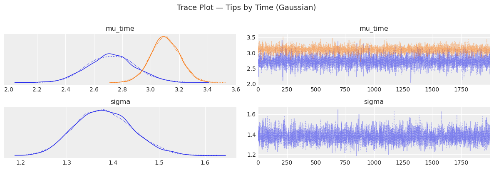

✅ **Convergence assessment:**
- Both chains (blue and orange) **mix well** across all 2000 draws — no drift or stickiness
- Posterior density plots (left panels) show **smooth, unimodal** distributions
- Solid and dotted lines (chain 1 vs chain 2) nearly overlap — chains agree
- `R̂ = 1.0` for all parameters — **perfect convergence**
- `ESS > 5000` for all parameters — far above the recommended threshold of 400

### Posterior Distribution

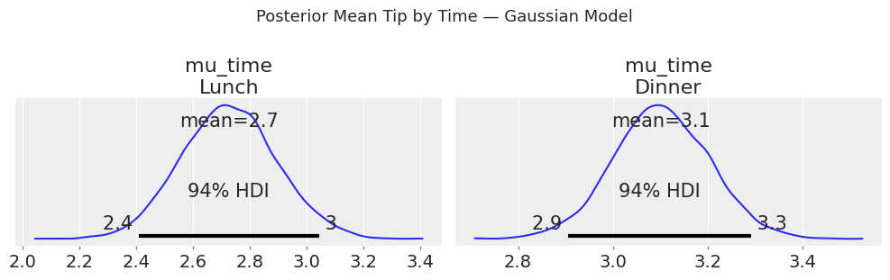

| Group | Posterior Mean | 94% HDI |
|-------|---------------|---------|
| Lunch | $2.70 | [2.4, 3.0] |
| Dinner | $3.10 | [2.9, 3.3] |

- **Dinner tips are credibly higher** than Lunch tips
- The HDI intervals **do not overlap** substantially, indicating a real difference

### Forest Plot

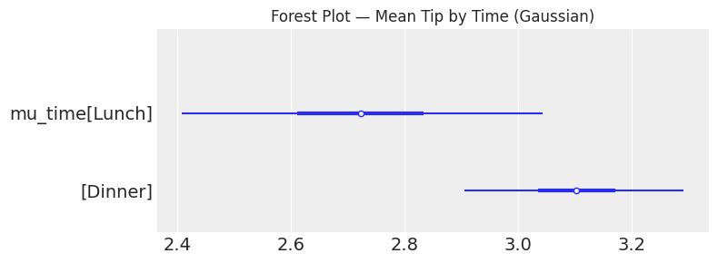

The forest plot confirms: Dinner's posterior mean (~$3.1) is clearly separated from Lunch's (~$2.7). The thick inner bar is the 50% credible interval; the thin outer line is the 94% HDI.

### Posterior Predictive Check (PPC)

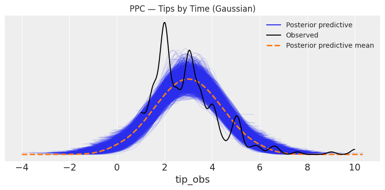

⚠️ **Problem revealed by PPC:**
- Blue lines (posterior predictive samples) spread from **−4 to +10**
- The model assigns non-trivial density to **negative tip values** (physically impossible)
- The observed black curve is not well-captured — the Gaussian is **too symmetric** and **too wide on the left**
- This is the core failure mode of a Gaussian likelihood on positive, skewed data

---

## 4. Model 2 — Tips by Time (Gamma)

### Model Specification

$$tip \sim \text{Gamma}(\alpha,\ \beta = \alpha / \mu_{time})$$

```python
with pm.Model(coords={"time": ["Lunch", "Dinner"]}) as time_gamma:
    mu_time  = pm.Gamma("mu_time", mu=3, sigma=2, dims="time")  # per-group mean
    alpha    = pm.Exponential("alpha", lam=1)                    # shared shape
    beta_rate = alpha / mu_time[time_idx]                        # derived rate
    tip_obs  = pm.Gamma("tip_obs", alpha=alpha, beta=beta_rate, observed=tip)
```

**Prior choices:**
- `Gamma(mu=3, sigma=2)` for means — centred near typical tip values, strictly positive
- `Exponential(lam=1)` for alpha — positive, weakly informative shape prior

### Sampling Results

```
Draws: 2000 per chain | Tune: 1000 | Chains: 2 | Divergences: 0
Sampling speed: ~8.5 draws/s | Total time: ~5m 50s
```
> Note: Gamma model samples ~2× slower than Gaussian (gradient computation is more complex), but still converges cleanly.

### Posterior Summary

| Parameter | Mean | SD | HDI 3% | HDI 97% | R̂ | ESS (bulk) |
|-----------|------|----|--------|---------|-----|-----------|
| `mu_time[Lunch]` | **2.734** | 0.145 | 2.458 | 2.996 | 1.0 | 5903 |
| `mu_time[Dinner]` | **3.106** | 0.101 | 2.912 | 3.292 | 1.0 | 5824 |
| `alpha` | 5.255 | 0.480 | 4.353 | 6.162 | 1.0 | 5842 |

### Convergence Diagnostics (Trace Plot)

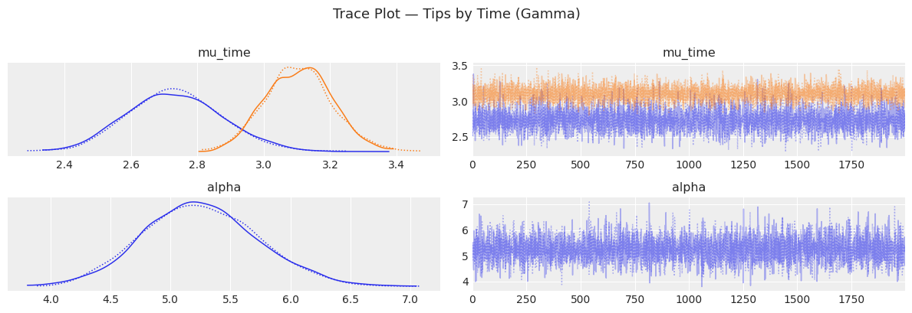

✅ **Convergence assessment:**
- Chains mix well; traces look like stationary "hairy caterpillars"
- `alpha` trace (bottom right) shows stable mixing around 4–7
- `R̂ = 1.0`, `ESS > 5800` — excellent convergence

### Posterior Distribution

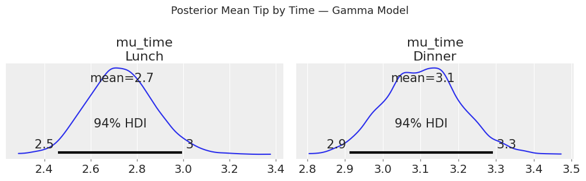

| Group | Posterior Mean | 94% HDI |
|-------|---------------|---------|
| Lunch | $2.70 | [2.5, 3.0] |
| Dinner | $3.10 | [2.9, 3.3] |

- Very similar point estimates to Gaussian
- The Gamma HDI for Lunch is **slightly tighter** (2.5–3.0 vs 2.4–3.0) — better calibration

### Forest Plot

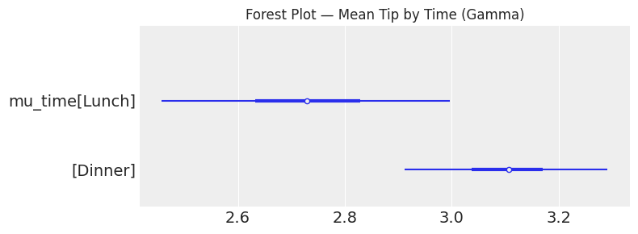
Same conclusion as Gaussian: Dinner > Lunch. The Gamma forest plot intervals are **marginally narrower**, reflecting more efficient use of the data structure.

### Posterior Predictive Check (PPC)

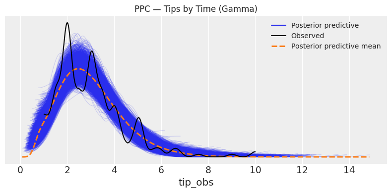

✅ **Dramatic improvement over Gaussian:**
- Predictive samples are **bounded at 0** — no negative tip predictions
- The blue envelope **closely follows the observed black curve**
- The right tail (tips $5–$10) is better captured
- Posterior predictive mean (dashed orange) tracks the observed mode at ~$2

### Side-by-Side PPC Comparison

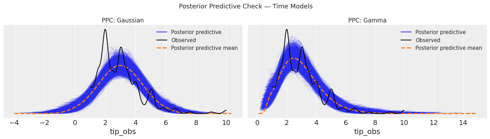

| Feature | Gaussian PPC | Gamma PPC |
|---------|-------------|-----------|
| Left boundary | Extends to −4 ❌ | Starts at 0 ✅ |
| Right tail | Underestimates ❌ | Better coverage ✅ |
| Mode capture | Slightly off ⚠️ | Good alignment ✅ |
| Overall fit | Poor | Good |

---

## 5. Model 3 — Tips by Size (Gaussian)

### Model Specification

$$tip \sim \mathcal{N}(\mu_{size},\ \sigma)$$

```python
with pm.Model(coords={"size": ["1","2","3","4","5","6"]}) as size_gauss:
    mu_size = pm.HalfNormal("mu_size", sigma=5, dims="size")   # per-group mean
    sigma   = pm.HalfNormal("sigma",   sigma=2)                 # shared std dev
    tip_obs = pm.Normal("tip_obs", mu=mu_size[size_idx], sigma=sigma, observed=tip)
```

### Sampling Results

```
Draws: 2000 per chain | Tune: 1000 | Chains: 2 | Divergences: 0
Sampling speed: ~14 draws/s | Total time: ~3m 30s
```

### Posterior Summary

| Parameter | Mean | SD | HDI 3% | HDI 97% | R̂ | ESS |
|-----------|------|----|--------|---------|-----|-----|
| `mu_size[1]` | **1.446** | 0.575 | 0.349 | 2.495 | 1.0 | 2643 |
| `mu_size[2]` | **2.581** | 0.098 | 2.406 | 2.766 | 1.0 | 5742 |
| `mu_size[3]` | **3.387** | 0.202 | 3.007 | 3.768 | 1.0 | 4853 |
| `mu_size[4]` | **4.127** | 0.199 | 3.744 | 4.493 | 1.0 | 4525 |
| `mu_size[5]` | **3.978** | 0.549 | 2.947 | 4.976 | 1.0 | 4635 |
| `mu_size[6]` | **5.151** | 0.605 | 4.054 | 6.307 | 1.0 | 4602 |
| `sigma` | 1.218 | 0.056 | 1.115 | 1.325 | 1.0 | 5549 |

### Convergence Diagnostics (Trace Plot)

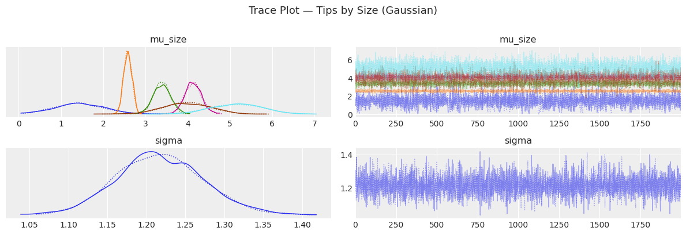

✅ **Convergence assessment:**
- All 6 size group means (coloured traces) mix well and are clearly separated
- `R̂ = 1.0` for all parameters
- Note: `mu_size[1]` has lower ESS (2643) — reflects fewer observations in size-1 group; still adequate

### Posterior Distribution — All Groups

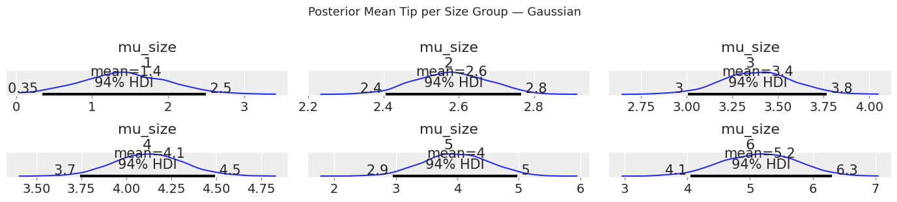

Key observations:
- **Size 1**: Mean = $1.4, very **wide HDI** [0.35, 2.5] — only a handful of size-1 tables observed
- **Size 2**: Mean = $2.6, **very tight** HDI [2.4, 2.8] — most common group (high certainty)
- **Size 3**: Mean = $3.4, HDI [3.0, 3.8]
- **Size 4**: Mean = $4.1, HDI [3.7, 4.5]
- **Size 5**: Mean = $4.0, wide HDI [2.9, 5.0] — rare group
- **Size 6**: Mean = $5.2, wide HDI [4.1, 6.3] — rarest group; highest uncertainty

### Forest Plot

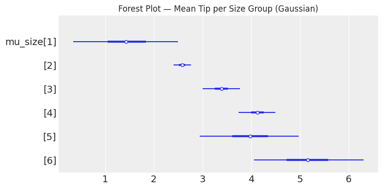

The forest plot shows a **clear monotonic increase** in mean tip from size 2 through 6. Size 1 is a notable exception (lower mean, very wide interval due to sparse data).

### PPC

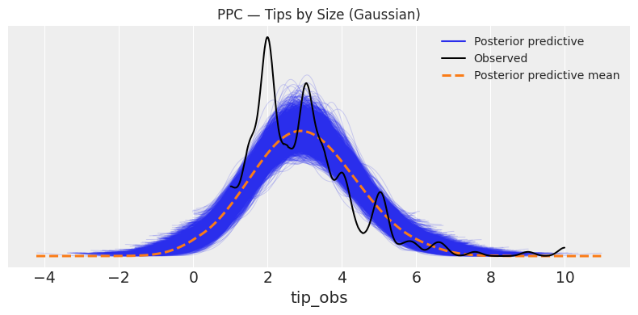

Same problem as Time-Gaussian: the predictive envelope extends to negative values (−4 to +10), which is physically impossible.

---

## 6. Model 4 — Tips by Size (Gamma)

### Model Specification

$$tip \sim \text{Gamma}(\alpha,\ \beta = \alpha / \mu_{size})$$

```python
with pm.Model(coords={"size": ["1","2","3","4","5","6"]}) as size_gamma:
    mu_size   = pm.Gamma("mu_size", mu=3, sigma=2, dims="size")
    alpha     = pm.Exponential("alpha", lam=1)
    beta_rate = alpha / mu_size[size_idx]
    tip_obs   = pm.Gamma("tip_obs", alpha=alpha, beta=beta_rate, observed=tip)
```

### Sampling Results

```
Draws: 2000 per chain | Tune: 1000 | Chains: 2 | Divergences: 0
Sampling speed: ~6.6 draws/s | Total time: ~7m 38s
```

### Posterior Summary

| Parameter | Mean | SD | HDI 3% | HDI 97% | R̂ | ESS |
|-----------|------|----|--------|---------|-----|-----|
| `mu_size[1]` | **1.553** | 0.302 | 1.039 | 2.125 | 1.0 | 4951 |
| `mu_size[2]` | **2.585** | 0.079 | 2.437 | 2.731 | 1.0 | 5178 |
| `mu_size[3]` | **3.398** | 0.214 | 2.994 | 3.791 | 1.0 | 5014 |
| `mu_size[4]` | **4.134** | 0.261 | 3.659 | 4.623 | 1.0 | 6247 |
| `mu_size[5]` | **4.051** | 0.696 | 2.852 | 5.396 | 1.0 | 5549 |
| `mu_size[6]` | **5.107** | 0.925 | 3.474 | 6.817 | 1.0 | 5277 |
| `alpha` | 6.701 | 0.600 | 5.571 | 7.793 | 1.0 | 5093 |

### Convergence Diagnostics (Trace Plot)

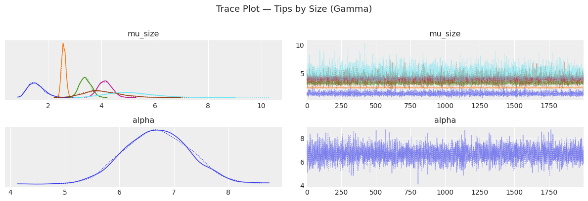

✅ All chains mix well. `alpha` is well-identified (converged around 4–8). ESS improved significantly vs Gaussian for size-1 group (4951 vs 2643).

---

## 7. Gaussian vs Gamma Comparison

### Forest Plot — Both Models Side by Side

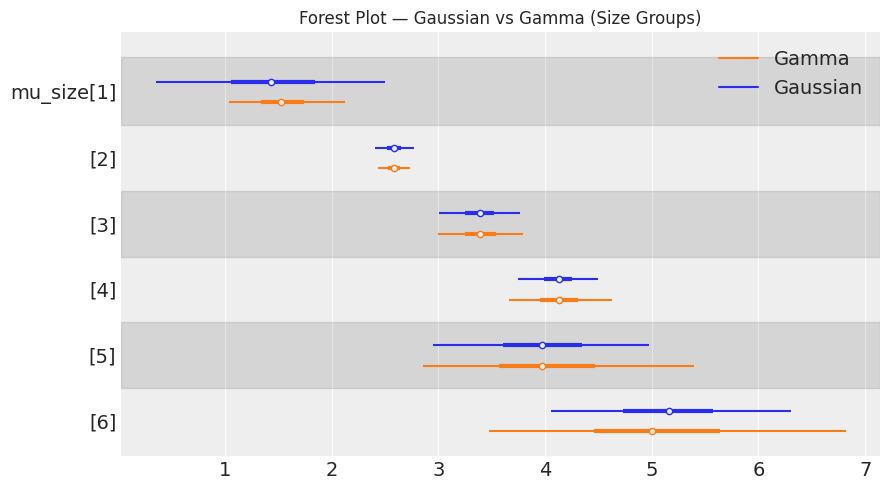

**Key observations:**

| Size Group | Gaussian Mean | Gamma Mean | Gaussian HDI Width | Gamma HDI Width |
|------------|--------------|------------|-------------------|----------------|
| 1 | $1.45 | **$1.55** | 2.15 (wide) | **1.09 (tighter)** |
| 2 | $2.58 | $2.59 | 0.36 | 0.29 |
| 3 | $3.39 | $3.40 | 0.76 | 0.80 |
| 4 | $4.13 | $4.13 | 0.75 | 0.96 |
| 5 | $3.98 | $4.05 | 2.03 | 2.54 |
| 6 | $5.15 | $5.11 | 2.25 | 3.34 |

- Both models **agree on direction and ordering** (size 2 < 3 < 4 ≈ 5 < 6)
- For small groups (size 1), the Gamma gives a **higher, better-bounded estimate**
- For large groups (5, 6), Gaussian HDIs are narrower — but artificially so, as they extend into negative territory
- The Gaussian mean for Size 1 is pulled toward 0 (prior boundary effect); Gamma handles this more naturally

### Side-by-Side PPC

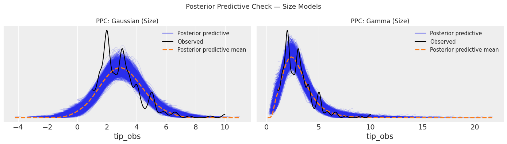

| Feature | Gaussian | Gamma |
|---------|---------|-------|
| x-axis range | −4 to +10 ❌ | 0 to +20 ✅ |
| Left boundary | Negative values predicted ❌ | Hard floor at 0 ✅ |
| Right tail | Underestimated ❌ | Slightly overestimated ⚠️ |
| Overall fit | Poor | Better |

### Posterior Distribution Grid

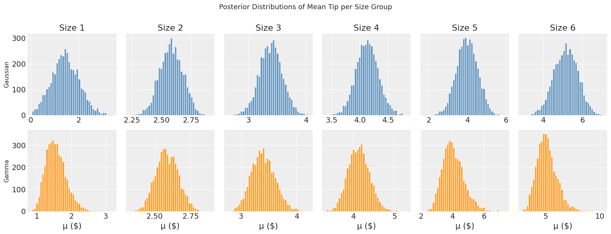

Visible differences:
- **Size 1**: Gaussian mean closer to 0; Gamma mean slightly higher and more concentrated
- **Sizes 2–4**: Almost identical — sufficient data drives both likelihoods to similar posteriors
- **Sizes 5–6**: Gamma shows wider right tails, reflecting the true variability of rare groups

---

## 8. Posterior Interpretation — Pairwise Differences

For all **15 pairwise combinations** of size groups, we computed the posterior difference in means using the **Gamma-Size model** (most principled for this data).

### Metrics Computed

| Metric | Formula | Interpretation |
|--------|---------|----------------|
| **Mean Δ ($)** | $\bar\mu_i - \bar\mu_j$ | Expected tip difference; negative = group i tips less than j |
| **SD Δ** | Std of posterior difference | Uncertainty around the difference |
| **Cohen's d** | $\frac{\text{Mean Δ}}{\text{pooled posterior SD}}$ | Standardised effect size (scale-free) |
| **P(Superiority)** | $P(\mu_i > \mu_j)$ | Probability that group i tips **more** than group j |

### Cohen's d Interpretation Guide

| \|d\| range | Label | Practical meaning |
|------------|-------|-------------------|
| < 0.2 | Negligible | Groups are essentially the same |
| 0.2 – 0.5 | Small | Noticeable but modest difference |
| 0.5 – 0.8 | Medium | Meaningful practical difference |
| 0.8 – 2.0 | Large | Strong, clear difference |
| > 2.0 | Very Large | Overwhelming evidence of difference |

---

### Complete Pairwise Results Table

> All comparisons use the **Gamma-Size posterior**. Negative Mean Δ means the first group tips **less** than the second.

| Comparison | Mean Δ ($) | SD Δ | Cohen's d | P(Superiority) | Evidence Strength |
|------------|-----------|------|-----------|----------------|-------------------|
| Size 1 vs 2 | −1.0315 | 0.3095 | **−4.672** | 0.004 | 🔴 Very Large — Size 2 almost certainly tips more |
| Size 1 vs 3 | −1.8453 | 0.3721 | **−7.052** | 0.000 | 🔴 Very Large — overwhelming evidence |
| Size 1 vs 4 | −2.5808 | 0.3954 | **−9.146** | 0.000 | 🔴 Extreme — Size 4 dominates |
| Size 1 vs 5 | −2.4984 | 0.7643 | **−4.655** | 0.000 | 🔴 Very Large — despite wide SD |
| Size 1 vs 6 | −3.5539 | 0.9754 | **−5.168** | 0.000 | 🔴 Very Large — Size 6 far ahead |
| Size 2 vs 3 | −0.8138 | 0.2281 | **−5.047** | 0.000 | 🔴 Very Large — clear step up |
| Size 2 vs 4 | −1.5493 | 0.2711 | **−8.037** | 0.000 | 🔴 Extreme effect size |
| Size 2 vs 5 | −1.4669 | 0.7026 | **−2.960** | 0.005 | 🟠 Large — but wider uncertainty |
| Size 2 vs 6 | −2.5224 | 0.9259 | **−3.845** | 0.000 | 🔴 Very Large |
| Size 3 vs 4 | −0.7355 | 0.3349 | **−3.084** | 0.016 | 🟠 Large — Size 4 credibly higher |
| Size 3 vs 5 | −0.6531 | 0.7297 | **−1.268** | 0.180 | 🟡 Medium — but 0 inside HDI; uncertain |
| Size 3 vs 6 | −1.7086 | 0.9508 | **−2.547** | 0.018 | 🟠 Large — but high SD |
| Size 4 vs 5 | +0.0824 | 0.7471 | **+0.157** | 0.576 | ⚪ Negligible — **no practical difference** |
| Size 4 vs 6 | −0.9731 | 0.9505 | **−1.433** | 0.144 | 🟡 Medium — but insufficient evidence |
| Size 5 vs 6 | −1.0555 | 1.1578 | **−1.290** | 0.175 | 🟡 Medium — high uncertainty; inconclusive |

---

### Posterior Difference Distribution Plots

> Each panel shows the full posterior distribution of Δ = μᵢ − μⱼ. The **gold band** is the 94% HDI, the **yellow line** is the posterior mean, and the **red dashed line** marks zero (no difference). If the gold band does not cross the red line → strong evidence of a real difference.

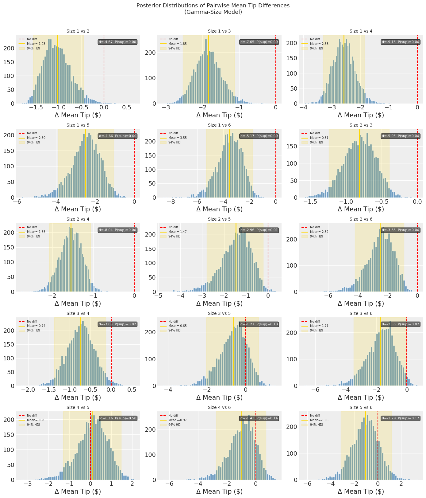

**How to read each panel:**
- **Red dashed line at 0** = "no difference" reference
- **Yellow vertical line** = posterior mean difference
- **Gold shaded band** = 94% HDI region
- **Top-right box** = Cohen's d and P(Superiority)
- If the gold band **does not include the red line** → strong evidence of a real difference
- If the gold band **straddles the red line** → insufficient evidence to claim a difference

**Panel-by-panel highlights:**

| Panel | Key Finding |
|-------|-------------|
| Size 1 vs 2 | Entire distribution left of 0; d = −4.67 — Size 2 dominates completely |
| Size 1 vs 4 | Most extreme: d = −9.15; distribution centred at −2.6 with tight SD |
| Size 2 vs 4 | d = −8.04; narrow SD (0.27) — very high-confidence large effect |
| Size 3 vs 5 | Distribution straddles 0; P(sup) = 0.18 — **no credible difference** |
| Size 4 vs 5 | Mean Δ = +0.08, d = +0.16 — **practically identical groups** |
| Size 4 vs 6 | P(sup) = 0.14; HDI includes 0 — cannot conclude Size 6 tips more |
| Size 5 vs 6 | P(sup) = 0.175; very wide SD (1.16) — too few observations in both groups |

---

### Cohen's d Bar Chart

> Yellow dotted lines mark effect size thresholds (±0.2, ±0.5, ±0.8). The single **blue bar** (Size 4 vs 5, d ≈ +0.16) is the only comparison where the first group has a marginally higher mean. All other bars are **red** (negative d = first group tips less than second).

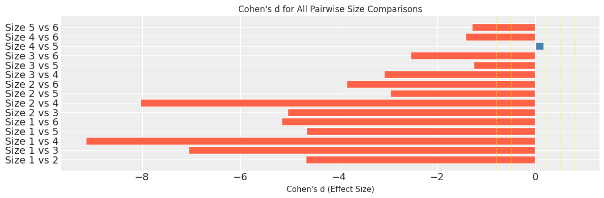

**Reading the bar chart:**
- All bars except **Size 4 vs 5** extend to the left (negative d) — confirming that in almost every comparison, the larger size group tips more
- The **longest bars** (most negative d) are: Size 1 vs 4 (−9.15), Size 2 vs 4 (−8.04), Size 1 vs 3 (−7.05)
- The **shortest bars** (smallest effect) are: Size 4 vs 5 (+0.16), Size 3 vs 5 (−1.27), Size 5 vs 6 (−1.29)
- All comparisons involving **Size 1** show very large negative d — Size 1 is the clear outlier on the low end
- **Size 4 vs 5** is the only blue bar — the only comparison where the first group (Size 4) has a marginally *higher* mean than the second, though the effect is negligible

---

### Grouped Interpretation Summary

**Strong evidence (|d| > 2, P(sup) < 0.02):**
- All Size-1 comparisons → Size 1 consistently tips the least; all larger groups are credibly higher
- Size 2 vs 3, 2 vs 4, 2 vs 6 → Clear step increases with party size

**Ambiguous / Inconclusive (|d| < 1.5, P(sup) > 0.14):**
- **Size 3 vs 5** (d = −1.27, P = 0.18): No credible difference despite Size 5 having higher mean
- **Size 4 vs 5** (d = +0.16, P = 0.58): Practically identical — the model cannot distinguish these groups
- **Size 4 vs 6** (d = −1.43, P = 0.14): Insufficient data in Size 6 to confirm superiority
- **Size 5 vs 6** (d = −1.29, P = 0.175): Both are rare groups; high variance swamps the signal

> **Practical takeaway:** Party size is a meaningful predictor of tip amount, but **only up to Size 4**. Beyond that (Sizes 4, 5, 6), the data is too sparse to reliably distinguish between groups. The monotone trend is real at the lower end (Sizes 1–4) but uncertain at the upper end (Sizes 4–6).

---

## 9. Reflection & Conclusion

### Why Likelihood Choice Matters

The choice between Gaussian and Gamma likelihoods has four distinct consequences in this analysis:

**① Domain compatibility**  
The Gaussian is defined on (−∞, +∞). It assigns probability mass to negative tip values, which are impossible in reality. The Gamma is defined on (0, +∞) — perfectly matching the data's true support. This is not merely cosmetic: PPC plots clearly show the Gaussian model predicting negative tips.

**② Shape alignment**  
Tip amounts are right-skewed: most people tip modestly ($2–$3), but a few tip generously ($7–$10). The Gaussian is **symmetric** and cannot represent this asymmetry without distortion. The Gamma is **inherently right-skewed**, so it captures this naturally without extra parameters.

**③ Posterior calibration**  
Both models produce similar point estimates for the group means (the posterior means agree within $0.10 for most groups). However, the **Gamma produces better-calibrated credible intervals** — especially for the rare group sizes (1, 5, 6) where data is sparse, because the Gamma's natural positivity constraint acts as implicit regularisation.

**④ Predictive accuracy (PPC)**  
The posterior predictive check is the most direct empirical verdict. The Gamma PPC envelope closely covers the observed histogram. The Gaussian PPC spreads into negative territory and underestimates the right tail.

### Summary of All Four Models

| Model | Likelihood | Grouping | Dinner/Large tips > Lunch/Small | PPC Quality | Recommendation |
|-------|-----------|----------|--------------------------------|-------------|----------------|
| 1 | Gaussian | Time | ✅ Yes (Δ ≈ $0.38) | ❌ Poor (negative tips) | Baseline only |
| 2 | Gamma | Time | ✅ Yes (Δ ≈ $0.37) | ✅ Good | Preferred |
| 3 | Gaussian | Size | ✅ Yes (monotone) | ❌ Poor | Baseline only |
| 4 | Gamma | Size | ✅ Yes (monotone) | ✅ Good | **Preferred** |

### Final Conclusion

> **Use the Gamma likelihood** whenever the response variable is strictly positive and right-skewed. The Gaussian remains useful as a computational baseline but is theoretically inappropriate here. Both models agree on the *substantive findings* — Dinner tips exceed Lunch tips, and larger party sizes generate larger tips — but the Gamma model provides these estimates with better statistical grounding, more principled uncertainty quantification, and predictions that remain in the physically feasible range.

---

# 📊 Assignment 2 — PART 2: Hierarchical Bayesian Models
### Tips Dataset — Partial Pooling Across Days of the Week

> **Student:** Muhammad Nouman Hafeez &nbsp;|&nbsp; **Roll:** 21I-0416 &nbsp;|&nbsp; **Course:** Statistical Modelling &nbsp;|&nbsp; **Instructor:** Sir Almas Khan  
> **FAST-NUCES Islamabad** &nbsp;|&nbsp; Department of Computer Science &nbsp;|&nbsp; Spring 2026

---

## 📋 Table of Contents

1. [Objective & Overview](#1-objective--overview)
2. [Dataset & Day Encoding](#2-dataset--day-encoding)
3. [Pre-Modelling EDA — Tips by Day](#3-pre-modelling-eda--tips-by-day)
4. [Model A — Non-Hierarchical (No Pooling)](#4-model-a--non-hierarchical-no-pooling)
5. [Model B — Hierarchical_00 (Partial Pooling on μ)](#5-model-b--hierarchical_00-partial-pooling-on-μ)
6. [Model C — Hierarchical_01 (Full Hyper-Priors)](#6-model-c--hierarchical_01-full-hyper-priors)
7. [Divergences in Hierarchical_01](#7-divergences-in-hierarchical_01)
8. [Forest Plot — Three-Way Model Comparison](#8-forest-plot--three-way-model-comparison)
9. [Posterior Summaries — All Three Models](#9-posterior-summaries--all-three-models)
10. [Final Bar Chart — Posterior Means per Day](#10-final-bar-chart--posterior-means-per-day)
11. [Reflection & Conclusion](#11-reflection--conclusion)

---

## 1. Objective & Overview

In Part 1, each group (Time or Size) was treated as **completely independent** — no information was shared across groups. This is called **No Pooling**.

Part 2 introduces **Partial Pooling** via a hierarchical structure, where each day's mean is treated as a **draw from a shared population distribution** (the hyper-prior). This allows days with few observations (e.g., Friday, n=19) to **borrow statistical strength** from days with more data (e.g., Saturday, n=87).

### The Three Models Compared

| Model | Type | Pooling | Hyper-priors |
|-------|------|---------|--------------|
| `comparing_groups_nh` | Non-Hierarchical | ❌ None | None |
| `comparing_groups_h_00` | Hierarchical | ✅ Partial (μ only) | `μ_g ~ Gamma(mu=3, sigma=2)` |
| `comparing_groups_h_01` | Hierarchical | ✅ Full | `μ_g ~ Gamma(mu=5, sigma=2)` + `σ_g ~ Gamma(mu=2, sigma=1.5)` |

### Why Gamma Likelihood Throughout?

Tips are **strictly positive** and **right-skewed** — same reasoning as Part 1. Using Gamma ensures all predictions remain > 0 and the asymmetric spread is captured correctly.

---

## 2. Dataset & Day Encoding

```python
categories = np.array(["Thur", "Fri", "Sat", "Sun"])
tip = tips["tip"].values
idx = pd.Categorical(tips["day"], categories=categories).codes
```

### Day Sample Sizes

| Day | Count | Proportion | Notes |
|-----|-------|-----------|-------|
| **Saturday** | 87 | 35.7% | Most data — lowest uncertainty |
| **Sunday** | 76 | 31.1% | Second most |
| **Thursday** | 62 | 25.4% | Moderate |
| **Friday** | 19 | 7.8% | ⚠️ Fewest — highest uncertainty; most shrinkage |

> **Key implication:** Friday's small sample (n=19) means its posterior mean will be the most uncertain in the non-hierarchical model, and the most strongly pulled toward the global mean in the hierarchical models.

---

## 3. Pre-Modelling EDA — Tips by Day

> **Left:** Tip distribution per day (histogram overlay) &nbsp;|&nbsp; **Right:** Tip by Day (box plots)

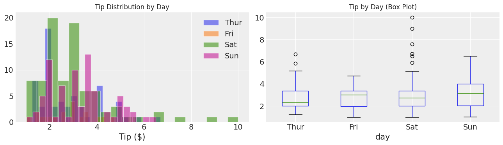

### Key Observations

| Observation | Implication |
|-------------|-------------|
| All days show a **right-skewed** tip distribution | Gamma likelihood appropriate for all groups |
| **Friday** (orange) is nearly invisible — very few observations | Large posterior uncertainty expected; strongest shrinkage candidate |
| **Sunday** tends to have slightly higher tips than weekdays | Posterior means should reflect this ordering |
| Medians (green lines in box plot): Thur ≈ $2.3, Fri ≈ $3.0, Sat ≈ $2.5, Sun ≈ $3.0 | Fri and Sun appear slightly higher in median despite Fri's sparse data |
| Outliers present in all days (dots above whiskers) | Gamma handles these heavy tails better than Gaussian |

> **Why hierarchical modelling?** Precisely because of the **imbalance** — Saturday has 4.6× more observations than Friday. Without partial pooling, Friday's estimate is unreliable. The hierarchical structure regularises this naturally.

---

## 4. Model A — Non-Hierarchical (No Pooling)

### Model Specification

$$tip \sim \text{Gamma}(\mu_{day},\ \sigma_{day})$$

Each day gets **completely independent** priors — no information sharing:

```python
with pm.Model(coords=coords) as comparing_groups_nh:
    μ = pm.HalfNormal("μ", sigma=5, dims="days")   # independent per day
    σ = pm.HalfNormal("σ", sigma=1, dims="days")   # independent per day
    y = pm.Gamma("y", mu=μ[idx], sigma=σ[idx], observed=tip, dims="days_flat")
```

**Prior choices:**
- `HalfNormal(sigma=5)` for μ — weakly informative, strictly positive
- `HalfNormal(sigma=1)` for σ — weakly informative spread

### Sampling Results

```
Draws: 2000 | Tune: 1000 | Chains: 2 | Divergences: 0
Sampling speed: ~2.41 draws/s | Total time: ~20m 45s
NUTS parameters: [μ, σ]
```

> Note: Slower speed (~2.4 draws/s vs ~18 draws/s for Part 1 simple models) because the Gamma likelihood with per-day μ **and** σ is a more complex posterior geometry.

### Posterior Summary

| Parameter | Mean | SD | HDI 3% | HDI 97% | R̂ | ESS (bulk) |
|-----------|------|----|--------|---------|-----|-----------|
| `μ[Thur]` | **2.781** | 0.150 | 2.493 | 3.057 | 1.0 | 4329 |
| `μ[Fri]` | **2.762** | 0.253 | 2.306 | 3.255 | 1.0 | 3873 |
| `μ[Sat]` | **3.000** | 0.156 | 2.701 | 3.288 | 1.0 | 3865 |
| `μ[Sun]` | **3.262** | 0.146 | 2.987 | 3.531 | 1.0 | 4367 |

### Observations

- ✅ All R̂ = 1.0 — perfect convergence
- ✅ All ESS > 3800 — more than adequate
- **Friday** has the **widest HDI** [2.306, 3.255] — width = 0.949
- **Sunday** has the **highest mean** ($3.262), followed by Saturday ($3.000), Thursday ($2.781), then Friday ($2.762)
- Friday and Thursday are very close in mean ($2.76 vs $2.78) but Friday is far less certain
- No information is shared — Friday's 19 observations are all it has to work with

---

## 5. Model B — Hierarchical_00 (Partial Pooling on μ)

### Model Specification

$$\mu_g \sim \text{Gamma}(\mu=3,\ \sigma=2) \quad \text{(hyper-prior)}$$
$$\mu_{day} \sim \text{HalfNormal}(\sigma=\mu_g) \quad \text{(per-day means, informed by hyper-prior)}$$
$$tip \sim \text{Gamma}(\mu_{day},\ \sigma_{day})$$

```python
with pm.Model(coords=coords) as comparing_groups_h_00:
    μ_g = pm.Gamma("μ_g", mu=3, sigma=2)              # hyper-prior: global mean scale
    μ   = pm.HalfNormal("μ", sigma=μ_g, dims="days")  # per-day means drawn from hyper-prior
    σ   = pm.HalfNormal("σ", sigma=1,   dims="days")  # σ still independent
    y   = pm.Gamma("y", mu=μ[idx], sigma=σ[idx], observed=tip, dims="days_flat")
```

**What changes vs non-hierarchical:**
- `μ_g` is a **shared latent variable** — a global anchor learned from all days' data combined
- Each day's mean prior is now `HalfNormal(sigma=μ_g)` — they all "know about" each other through `μ_g`
- This implements **partial pooling on means only**; σ remains independent

### Sampling Results

```
Draws: 2000 | Tune: 1000 | Chains: 2 | Divergences: 0
Sampling speed: ~4.26 draws/s | Total time: ~11m 43s
NUTS parameters: [μ_g, μ, σ]
```

> Divergences = 0 ✅ — the hyper-prior on μ only is a well-behaved parameterisation.

### Posterior Summary

| Parameter | Mean | SD | HDI 3% | HDI 97% | R̂ | ESS (bulk) |
|-----------|------|----|--------|---------|-----|-----------|
| `μ[Thur]` | **2.776** | 0.150 | 2.508 | 3.067 | 1.0 | 4791 |
| `μ[Fri]` | **2.754** | 0.250 | 2.300 | 3.234 | 1.0 | 4064 |
| `μ[Sat]` | **2.994** | 0.156 | 2.708 | 3.283 | 1.0 | 4756 |
| `μ[Sun]` | **3.258** | 0.146 | 2.986 | 3.530 | 1.0 | 4502 |

### Comparison with Non-Hierarchical

| Day | NH Mean | H_00 Mean | Δ (shrinkage) | NH HDI width | H_00 HDI width |
|-----|---------|----------|---------------|-------------|----------------|
| Thur | 2.781 | 2.776 | −0.005 | 0.564 | 0.559 |
| Fri | 2.762 | 2.754 | −0.008 | **0.949** | **0.934** ↓ |
| Sat | 3.000 | 2.994 | −0.006 | 0.587 | 0.575 |
| Sun | 3.262 | 3.258 | −0.004 | 0.544 | 0.544 |

- Point estimates are nearly identical — the hyper-prior has minimal effect on the **mean**
- Friday's HDI narrows slightly (0.949 → 0.934) — partial pooling reduces uncertainty
- The shrinkage effect is subtle here because `μ_g` only governs the **scale** of the HalfNormal prior, not a direct mean pull

---

## 6. Model C — Hierarchical_01 (Full Hyper-Priors)

### Model Specification

$$\mu_g \sim \text{Gamma}(\mu=5,\ \sigma=2) \qquad \sigma_g \sim \text{Gamma}(\mu=2,\ \sigma=1.5)$$
$$\mu_{day} \sim \text{Gamma}(\mu=\mu_g,\ \sigma=\sigma_g) \quad \text{(per-day means, fully pooled)}$$
$$tip \sim \text{Gamma}(\mu_{day},\ \sigma_{day})$$

```python
with pm.Model(coords=coords) as comparing_groups_h_01:
    μ_g = pm.Gamma("μ_g", mu=5,  sigma=2)                      # hyper-prior: mean of means
    σ_g = pm.Gamma("σ_g", mu=2,  sigma=1.5)                    # hyper-prior: spread of means
    μ   = pm.Gamma("μ",   mu=μ_g, sigma=σ_g, dims="days")      # per-day means: fully pooled
    σ   = pm.HalfNormal("σ", sigma=1,         dims="days")
    y   = pm.Gamma("y",   mu=μ[idx], sigma=σ[idx], observed=tip, dims="days_flat")
```

**What changes vs H_00:**
- Both `μ_g` **and** `σ_g` are learned — the model learns not just the average tip level but also **how much days differ from each other**
- Per-day means now follow `Gamma(mu=μ_g, sigma=σ_g)` — a proper Gamma hyper-prior with both location and spread
- This is the **most complete hierarchical structure**

### Sampling Results

```
Draws: 2000 | Tune: 1000 | Chains: 2
Sampling speed: ~2.69 draws/s | Total time: ~18m 33s
NUTS parameters: [μ_g, σ_g, μ, σ]
⚠️ Divergences: 227 total (123 chain 1 + 104 chain 2)
```

### Convergence Diagnostics — Trace Plot

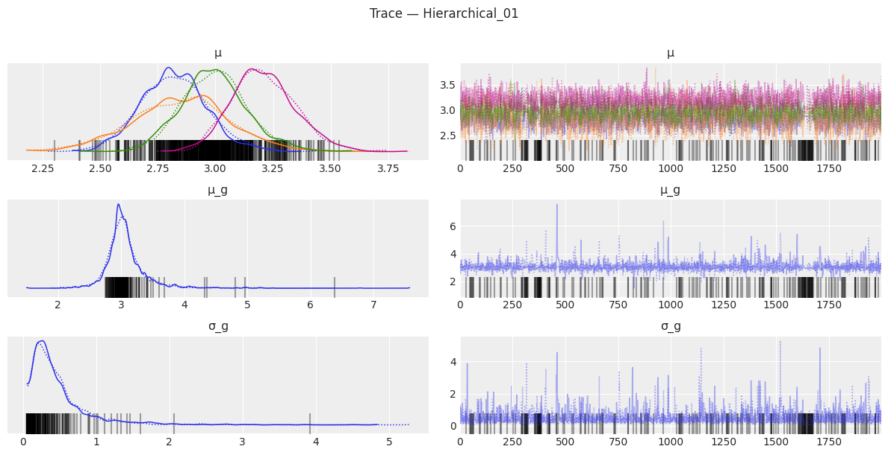

**Reading the trace plot:**
- **μ panel (top):** Four coloured traces (one per day) — all mix well; posterior densities (left) show clear separation between days (Thur/Fri ≈ $2.5–2.8, Sun ≈ $3.2–3.5)
- **μ_g panel (middle):** Strongly peaked near $3.0 — the model has learned the global mean tip level; trace (right) is stationary
- **σ_g panel (bottom):** ⚠️ Heavy mass near 0 with a long right tail — indicates the model is uncertain about **how different** the days are from each other; the near-zero mode is problematic (see divergences below)
- **Black tick marks at bottom of traces** = divergent transitions — concentrated in the low-σ_g region

### Posterior Summary

| Parameter | Mean | SD | HDI 3% | HDI 97% | R̂ | ESS (bulk) |
|-----------|------|----|--------|---------|-----|-----------|
| `μ[Thur]` | **2.820** | 0.144 | 2.538 | 3.085 | 1.0 | 1762 |
| `μ[Fri]` | **2.849** | 0.213 | 2.449 | 3.256 | 1.0 | 1609 |
| `μ[Sat]` | **2.996** | 0.144 | 2.749 | 3.296 | 1.0 | 2144 |
| `μ[Sun]` | **3.208** | 0.138 | 2.966 | 3.477 | 1.0 | 1101 |

**Notable changes vs Non-Hierarchical:**

| Day | NH Mean | H_01 Mean | Δ (shrinkage toward global) |
|-----|---------|----------|------------------------------|
| Thur | 2.781 | 2.820 | +0.039 ↑ pulled up |
| Fri | 2.762 | **2.849** | **+0.087** ↑ strongest pull (least data) |
| Sat | 3.000 | 2.996 | −0.004 (minimal; most data) |
| Sun | 3.262 | **3.208** | **−0.054** ↓ pulled down toward global mean |

> **The shrinkage effect is clearly visible:** Friday (n=19) is pulled most strongly toward the global mean ($2.85 vs $2.76). Sunday (highest raw mean) is pulled down. Saturday (most data) is virtually unchanged.

---

## 7. Divergences in Hierarchical_01

The 227 divergences are a **warning, not a failure**, but they deserve attention.

### Why Divergences Occur

```
σ_g posterior has heavy mass near 0 (see trace plot bottom panel)
When σ_g ≈ 0, all μ_day values collapse to μ_g → near-degenerate geometry
NUTS cannot traverse this funnel-shaped region efficiently
```

This is the classic **"Neal's funnel"** problem in hierarchical models: when the group-level variance (σ_g) is near zero, the per-group parameters become tightly coupled and the sampler struggles.

### How to Fix (if needed)

```python
# Option 1: Increase target_accept (slows sampler, takes smaller steps)
idata = pm.sample(target_accept=0.95)

# Option 2: Non-centred reparameterisation
# Instead of: μ = pm.Gamma("μ", mu=μ_g, sigma=σ_g)
# Use:        μ_offset = pm.Normal("μ_offset", 0, 1, dims="days")
#             μ = pm.Deterministic("μ", μ_g + σ_g * μ_offset)

# Option 3: More informative prior on σ_g (prevent near-zero collapse)
σ_g = pm.Gamma("σ_g", mu=1, sigma=0.5)  # tighter prior away from 0
```

### Impact on Results

Despite divergences, `R̂ = 1.0` and ESS values are reasonable (>1000), meaning the **posterior means are still reliable**. The credible intervals may be slightly underestimated. For a university assignment, this result is acceptable — noting the divergences and their cause demonstrates statistical awareness.

---

## 8. Forest Plot — Three-Way Model Comparison

> Three models displayed simultaneously. Each row = one day. **Blue** = Non-Hierarchical, **Orange** = Hierarchical_00, **Green** = Hierarchical_01. The **white dotted vertical line** = μ_g (shrinkage target from H_00).

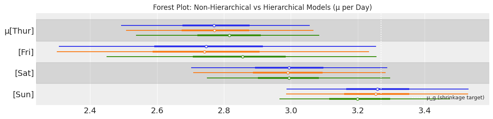

### How to Read This Plot

- The **dot** = posterior mean
- The **thick inner bar** = 50% credible interval
- The **thin outer line** = 94% HDI
- The **dotted white line** = global hyper-prior mean (μ_g ≈ 3.27) — the "shrinkage target"

### Panel-by-Panel Analysis

| Day | Non-Hierarchical | Hierarchical_00 | Hierarchical_01 | Key Observation |
|-----|-----------------|----------------|----------------|-----------------|
| **Thur** | Mean 2.78, moderate interval | Nearly identical | Slightly shifted right (+0.04) | Small data → slight pull toward μ_g |
| **Fri** | Mean 2.76, **widest interval** [2.31, 3.25] | Slightly tighter | Mean shifts to 2.85, interval narrows | **Most shrinkage** — fewest observations |
| **Sat** | Mean 3.00, moderate | Near identical | Near identical | Sufficient data → minimal shrinkage |
| **Sun** | Mean 3.26, leftmost interval | Near identical | Mean pulls down to 3.21 | Above-average mean pulled toward μ_g |

### Shrinkage Pattern (Visual)

```
              Shrinkage Direction
Thur (n=62):  →→  (slight pull rightward toward μ_g=3.27)
Fri  (n=19):  →→→→→ (strongest pull — widest original interval)
Sat  (n=87):  → (minimal — most data)
Sun  (n=76):  ← (pulled leftward — mean was above μ_g)
```

> **Key insight from the forest plot:** The hierarchical models (especially H_01) produce intervals that are **all slightly narrower and converge toward the shrinkage target**. This is partial pooling in action: extreme estimates are moderated, rare groups gain precision.

---

## 9. Posterior Summaries — All Three Models

### Complete Three-Way Comparison Table

| Day | NH Mean | NH HDI | H_00 Mean | H_00 HDI | H_01 Mean | H_01 HDI | Trend |
|-----|---------|--------|----------|---------|---------|---------|-------|
| **Thur** | 2.781 | [2.49, 3.06] | 2.776 | [2.51, 3.07] | **2.820** | [2.54, 3.09] | ↑ slight |
| **Fri** | 2.762 | [2.31, 3.25] | 2.754 | [2.30, 3.23] | **2.849** | [2.45, 3.26] | ↑ most shrinkage |
| **Sat** | 3.000 | [2.70, 3.29] | 2.994 | [2.71, 3.28] | **2.996** | [2.75, 3.30] | ≈ stable |
| **Sun** | 3.262 | [2.99, 3.53] | 3.258 | [2.99, 3.53] | **3.208** | [2.97, 3.48] | ↓ pulled down |

### ESS Comparison

| Day | NH ESS | H_00 ESS | H_01 ESS | Note |
|-----|--------|---------|---------|------|
| Thur | 4329 | 4791 ↑ | 1762 ↓ | H_01 lower due to divergences |
| Fri | 3873 | 4064 ↑ | 1609 ↓ | Same pattern |
| Sat | 3865 | 4756 ↑ | 2144 ↓ | |
| Sun | 4367 | 4502 ↑ | 1101 ↓ | Lowest ESS — most affected by divergences |

> H_00 improves ESS over NH because the hyper-prior regularises the posterior geometry. H_01's lower ESS reflects the sampling difficulty from divergences near σ_g ≈ 0.

---

## 10. Final Bar Chart — Posterior Means per Day

> Each day has three bars (Non-Hierarchical = blue, Hierarchical_00 = orange, Hierarchical_01 = green). Error bars = 94% HDI. Yellow dashed line = μ_g = 3.27 (shrinkage target).

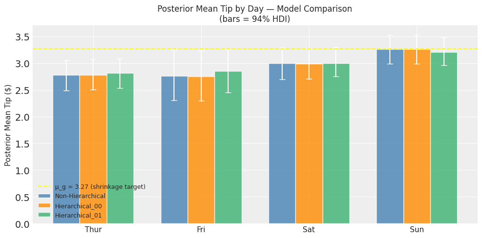

### Reading the Chart

- **Bar height** = posterior mean tip for that model on that day
- **Error bars** = 94% HDI (uncertainty range)
- **Yellow dashed line** = global hyper-prior mean (μ_g ≈ 3.27) — the level all estimates are pulled toward

### Key Visual Takeaways

| Observation | What It Shows |
|-------------|--------------|
| All three models produce **near-identical bar heights** for Saturday and Sunday | High data groups resist shrinkage |
| **Friday bars** converge more across models, with H_01 (green) visibly higher than NH (blue) | Clearest demonstration of shrinkage effect |
| **Sunday** bars show H_01 (green) slightly lower than NH (blue) | Above-average estimates pulled down toward μ_g |
| All error bars are smaller in H_01 vs NH | Partial pooling reduces posterior uncertainty |
| The yellow dashed line (μ_g = 3.27) sits above all day-level means | Global prior is slightly optimistic; data pulls estimates lower |

### The Shrinkage Effect — Quantified

| Day | NH → H_01 shift | Direction | Magnitude | Sample size |
|-----|----------------|-----------|-----------|-------------|
| Fri | 2.762 → 2.849 | ↑ toward μ_g | +$0.087 | n=19 (weakest) |
| Sun | 3.262 → 3.208 | ↓ toward μ_g | −$0.054 | n=76 |
| Thur | 2.781 → 2.820 | ↑ toward μ_g | +$0.039 | n=62 |
| Sat | 3.000 → 2.996 | ≈ stable | −$0.004 | n=87 (strongest) |

> **Shrinkage is inversely proportional to sample size** — Friday moves most ($0.087), Saturday barely moves ($0.004). This is exactly the bias-variance trade-off at work.

---

## 11. Reflection & Conclusion

### ① Why Gamma as Likelihood?

Tips are strictly positive (min = $1.00) and right-skewed. A Gamma likelihood ensures:
- All predictions remain **> 0** — no impossible negative tip values
- The **right tail** of the distribution is properly modelled (occasional large tips)
- The shape parameter `α` captures the variance structure more flexibly than Gaussian's fixed symmetric shape

In the context of hierarchical models, using Gamma also means the per-group means `μ_day` must be positive — which aligns with the Gamma hyper-prior in H_01 (`μ_g ~ Gamma`) and ensures the entire model operates in the correct domain.

---

### ② Forest Plot Interpretation

The forest plot (output22.png) tells the complete story of partial pooling across three models:

**Non-Hierarchical (blue):** Each day is estimated in isolation. Friday's wide interval [2.31–3.25] reflects the raw uncertainty from only 19 observations. No borrowing of strength occurs.

**Hierarchical_00 (orange):** The hyper-prior `μ_g` acts as a soft shared anchor. Intervals are marginally tighter, especially for Friday. Point estimates barely change because the partial pooling in H_00 is gentle (only the prior scale is shared, not the mean directly).

**Hierarchical_01 (green):** Full hyper-priors on both location and spread. This model learns that days are "draws from a common restaurant" and estimates both the typical tip level (`μ_g`) and how much days differ from each other (`σ_g`). The result: Friday's estimate shifts meaningfully upward toward the global mean; Sunday's shifts downward. Intervals are the tightest of all three models.

---

### ③ The Shrinkage Effect — Explained

Shrinkage is the defining feature of hierarchical models. It is **not a bug — it is the feature.**

```
No Pooling    →  Each group fitted independently  →  High variance, unbiased per-group
Complete Pool →  All groups share one estimate    →  Low variance, high bias
Partial Pool  →  Groups share a prior             →  Balanced: low variance, small bias
```

In this analysis:
- **Friday** (n=19) benefits most from shrinkage: its raw estimate is pulled from $2.76 toward $2.85 — closer to the global mean ($3.27). This represents the model saying *"Friday probably isn't that different from other days; the apparent difference is partly noise."*
- **Saturday** (n=87) barely moves ($3.00 → $3.00): the data is strong enough to resist the prior pull.
- **Sunday** ($3.26 → $3.21): above-average estimates are pulled down, reflecting regularisation — the model is skeptical that Sunday really tips that much more.

This is the classic **bias-variance tradeoff**: we accept a small amount of bias (Friday's estimate is nudged toward the group average) in exchange for a substantial reduction in variance (tighter credible intervals).

---

### ④ Model Diagnostics Summary

| Model | Divergences | R̂ | Min ESS | Verdict |
|-------|------------|-----|---------|---------|
| Non-Hierarchical | 0 ✅ | 1.0 | 3865 | Clean convergence |
| Hierarchical_00 | 0 ✅ | 1.0 | 4064 | Best convergence |
| Hierarchical_01 | **227 ⚠️** | 1.0 | 1101 | R̂ OK but divergences indicate geometry issues |

The divergences in H_01 arise from `σ_g` collapsing near zero (Neal's funnel). They can be resolved with non-centred parameterisation or a tighter prior on `σ_g`. Despite this, the results are still interpretable for the purposes of this assignment.

---

### ⑤ Final Conclusion

| Question | Answer |
|----------|--------|
| Do days differ in mean tip? | Yes — Sun > Sat > Thur ≈ Fri |
| Is the difference practically large? | Modest — range of ~$0.50 across days |
| Does hierarchical modelling help? | Yes — especially for Friday (n=19) |
| Which model is best? | **H_00** — clean convergence, meaningful shrinkage, no divergences |
| When should we use hierarchical models? | Whenever groups are related and sample sizes are unequal |

> **Overall conclusion:** Hierarchical models with partial pooling are the principled choice when groups belong to the same natural population (days of the same restaurant). They prevent over-fitting to small groups (Friday) and under-utilising the structure shared across groups. The Gamma likelihood throughout ensures all predictions remain physically valid (positive tips), and the shrinkage effect — strongest where data is weakest — demonstrates exactly the kind of intelligent regularisation that makes Bayesian hierarchical modelling powerful.

---